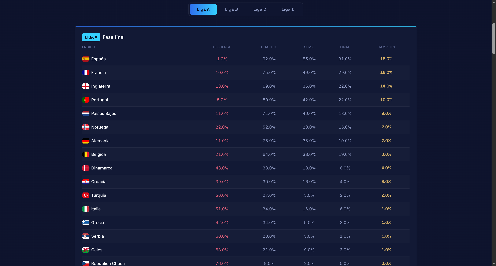
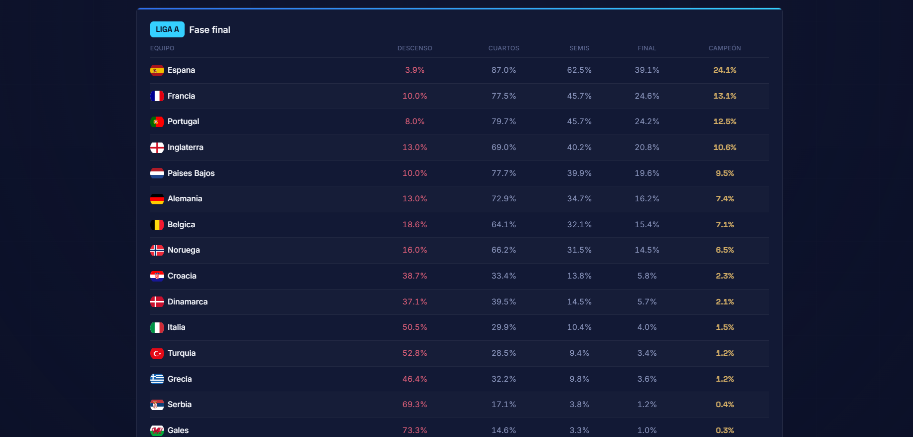
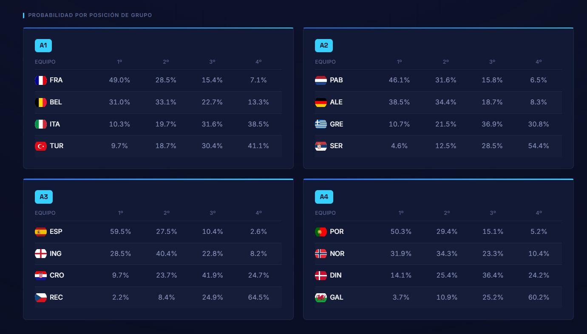
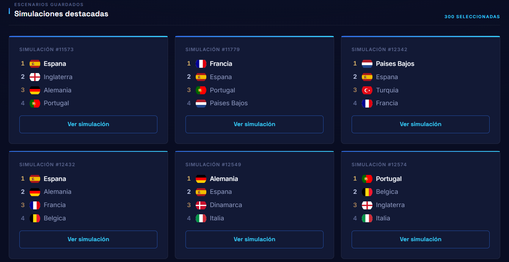
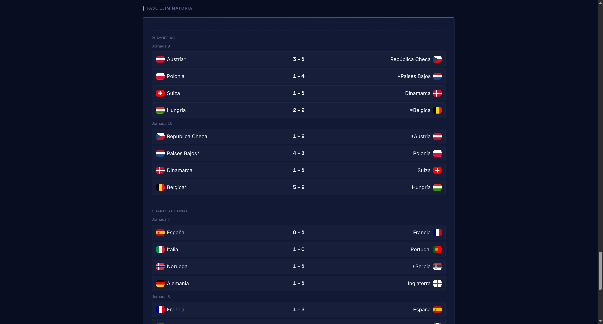
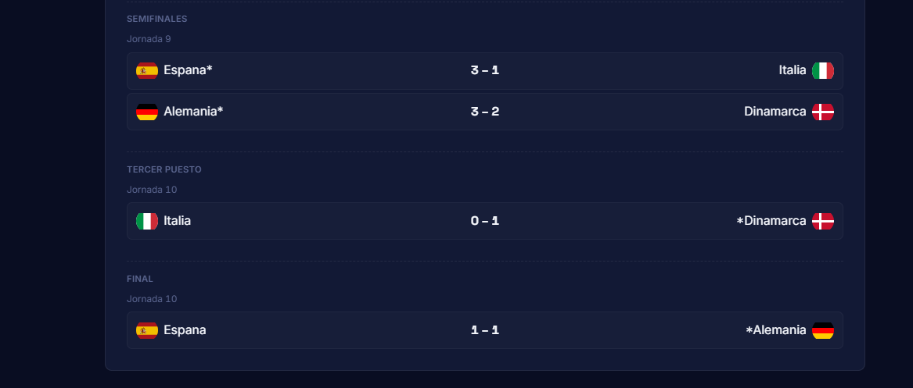

# UEFA Nations League Predictor

A Monte Carlo simulator for the UEFA Nations League: it runs thousands of full-tournament simulations (group stage, cross-league playoffs, quarter-finals and Final Four) to estimate the real probability of each national team getting promoted, relegated, or lifting the trophy.

## 🚀 Demo / Screenshot

> Add a link to the live demo or a screenshot of the main screen and a simulation detail view here.

## 📋 Table of contents

- [Features](#features)
- [Tech stack](#tech-stack)
- [Installation](#installation)
- [Configuration](#configuration)
- [Usage](#usage)
- [Project structure](#project-structure)
- [Tests](#tests)
- [Contributing](#contributing)
- [License](#license)
- [Author](#author)

## ✨ Features

- **Full-tournament Monte Carlo simulation**: group stage, promotion/relegation playoffs between leagues (A/B, B/C, C/D), two-legged quarter-finals, and a single-match Final Four.
- **Expected-goals model calibrated with real data**: per-team attack and defense ratings, fitted with a Poisson regression (Dixon-Coles/Maher style) over ~4,500 international matches from the last 4 years, instead of a single generic rating.
- **Global statistics per league**: probability of reaching the quarter-finals, semi-final, final and title (League A), or of being promoted/relegated (Leagues B, C and D).
- **Probability by group position**: broken down by each real group in the competition (A1–A4, B1–B4, C1–C4, D1–D2).
- **Saved individual simulations**: browse and open specific runs, with group standings, matchday-by-matchday results, and the full knockout bracket, marking the winner of each tie.
- **Custom-designed interface**: national flags, paginated simulation browsing, and a responsive layout.

## 🛠️ Tech stack

**Backend**
- Python 3
- FastAPI + Uvicorn
- tqdm

**Frontend**
- React + Vite
- Tailwind CSS v4
- flag-icons

**Data preparation** (`data_prep/`)
- pandas, NumPy, SciPy — fits the Poisson regression behind the attack/defense ratings

## 📦 Installation

```bash
git clone https://github.com/username/nations-league-ia.git
cd nations-league-ia
```

**Backend:**

```bash
pip install fastapi uvicorn tqdm
```

**Frontend** (in another terminal):

```bash
cd frontend
npm install
```

## ⚙️ Configuration

This project doesn't require any environment variables or API keys. The relevant settings live directly in the code:

- `main.py` → `N_SIMULATIONS` and `N_SAVED_SIMULATIONS`: total number of simulations to run, and how many are saved with full match detail.
- `main.py` → `CORSMiddleware` configuration: allowed origin for the frontend in development (`http://localhost:5173` by default).

## 💻 Usage

**1. Start the backend** from the project root:

```bash
python -m uvicorn main:app --reload
```

Available at `http://127.0.0.1:8000` (interactive docs at `/docs`).

**2. Start the frontend** from `frontend/`:

```bash
npm run dev
```

Available at `http://localhost:5173`.

**3. From the browser**, click **Simular torneo**. Once it finishes, you'll see the global statistics per league, the probability by group position, and a list of saved simulations you can open to see their full detail (groups, results, and knockout stage).

### Main endpoints

| Method | Route | Description |
|---|---|---|
| `POST` | `/api/simulate` | Runs a new batch of simulations |
| `GET` | `/api/results` | Global statistics and summary of saved simulations |
| `GET` | `/api/simulations/{id}` | Standings and full match list for a specific simulation |
| `GET` | `/api/teams` | List of national teams (code, name, league, group) |

## 📁 Project structure

```
nations-league-ia/
├── main.py                  # FastAPI entry point and simulation orchestration
├── api/                     # REST endpoints
├── data/                    # elo.csv, config.json, fixtures.json and generated results
├── data_prep/                # Fits attack/defense ratings from historical match data
│   ├── build_attack_defense.py
│   ├── team_mapping.py
│   └── output/
├── engine/                  # Simulation engine
│   ├── builders/             # Builds groups, leagues and the competition
│   ├── knockout/             # Quarter-finals, playoffs and Final Four
│   ├── loaders/               # Loads teams, fixtures and configuration
│   ├── models/                 # Expected-goals model
│   ├── probability/           # Poisson sampling
│   ├── rankings/               # Cross-group rankings
│   ├── simulators/             # Match, group and knockout simulation
│   └── standings/              # Standings calculation
├── models/                  # Domain entities (Team, Match, Tie, FinalFour...)
├── output/                  # JSON result persistence
├── utils/
└── frontend/                # React application
    └── src/
        ├── api/
        ├── components/
        └── App.jsx
```

## 🧪 Tests

This project currently has no automated tests. Contributions adding coverage (especially around the simulation engine and standings/tiebreak logic) are welcome.

## 🖼️ Images

<p align="center">
</p>

<p align="center">
</p>

<p align="center">
</p>


## 🤝 Contributing

Contributions are welcome. Please:

1. Fork the project
2. Create your branch (`git checkout -b feature/new-feature`)
3. Commit your changes
4. Push to the branch
5. Open a Pull Request

## 👤 Author

Alejandro Maldonado - [@alexmaro10](https://github.com/alexmaro10)
